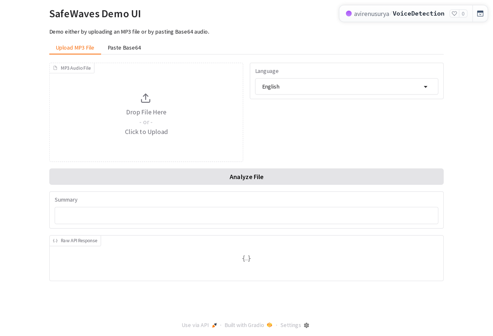

<div align="center">

# safewaves-voice

**Detect whether a voice clip is AI-generated or human.**

An API-first detector for five languages (Tamil, English, Hindi, Malayalam, Telugu). It returns a strict label, a confidence score, and a short reason. There is also a small Gradio demo UI.


[**Live demo (Hugging Face Space)**](https://huggingface.co/spaces/avirenusurya/VoiceDetection)



</div>

🏆 Built at the **India AI Impact Buildathon** (GUVI x HCL), where I reached the **Top 2% of 40,000+** participants and my team went on to finish in the Top 20.

---

## What it does

AI voice clones are good enough to impersonate people in scam and fraud calls. safewaves-voice classifies a clip as `AI_GENERATED` or `HUMAN` with a confidence score, so it can sit behind a verification step in a pipeline.

## API

`POST /api/voice-detection`

Headers: `Content-Type: application/json`, `x-api-key: <your_api_key>`

Request:

```json
{
  "language": "Tamil",
  "audioFormat": "mp3",
  "audioBase64": "BASE64_ENCODED_MP3"
}
```

Response:

```json
{
  "status": "success",
  "language": "Tamil",
  "classification": "AI_GENERATED",
  "confidenceScore": 0.91,
  "explanation": "Unnatural spectral consistency (Confidence: 91.0%)"
}
```

## How it works

1. Audio arrives as Base64 MP3.
2. The API validates the key, language, and format.
3. The clip is decoded into a model-ready waveform.
4. The detector predicts a class and confidence.
5. Output is normalized to a strict `AI_GENERATED` or `HUMAN` label.

The design favors accuracy over latency, and always returns a confidence and reason so a caller can decide how much to trust the verdict.

## Run locally

```bash
cd safewaves-voice
python -m venv venv && source venv/bin/activate
pip install -r requirements.txt

export API_KEY=your_api_key
export PREFERRED_DEVICE=cpu        # defaults to cuda on a local machine
python app.py
```

- API docs: `http://localhost:7860/docs`
- Demo UI: `http://localhost:7860/ui`

The model loads from `models/DF_Arena` by default, or set `MODEL_PATH` to point elsewhere.

## Model

This project uses the `Speech-Arena-2025/DF_Arena_1B_V_1` model (wav2vec2 XLS-R with a Conformer-based pipeline) and local files derived from DF_Arena.

```bibtex
@misc{kulkarni_2024_df_arena_1b,
  author    = {Ajinkya Kulkarni and Atharva Kulkarni and Sandipana Dowerah and Matthew Magimai Doss and Tanel Alumäe},
  title     = {DF_Arena_1B_V_1 - Universal Audio Deepfake Detection},
  year      = {2025},
  publisher = {Hugging Face},
  url       = {https://huggingface.co/Speech-Arena-2025/DF_Arena_1B_V_1/}
}
```

## Limitations

- Very short or very noisy clips lower confidence.
- Heavily compressed or transcoded audio can reduce reliability.
